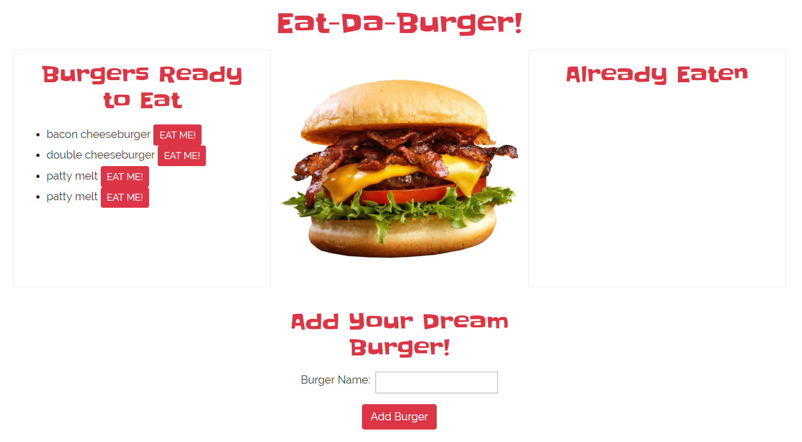

# burger
A full stack application using a MySQL database that keeps track of burgers eaten and burgers desired

#Screenshot

# How It Works
To add a burger to the "Burgers Ready to Eat" box, type your burger into the "Add Your Dream Burger!" box and click "Add Burger". Once the burger has been eaten, click the "EAT ME" button next to the burger to move it to the "Already Eaten" box. 

# Technologies Used
* Bootstrap
* Handlebars
* Node.js
* Express
* MySQL

